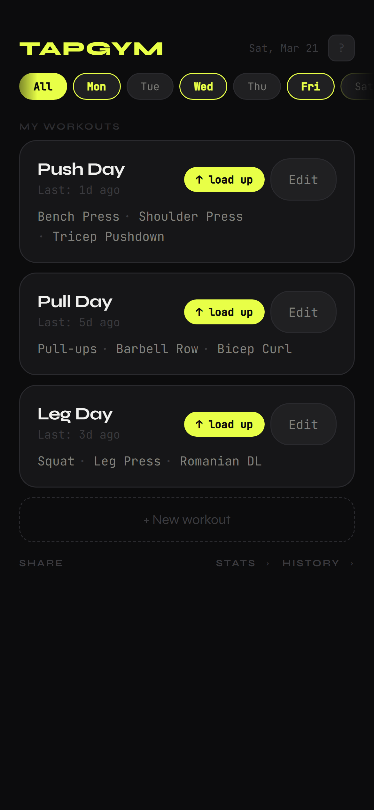
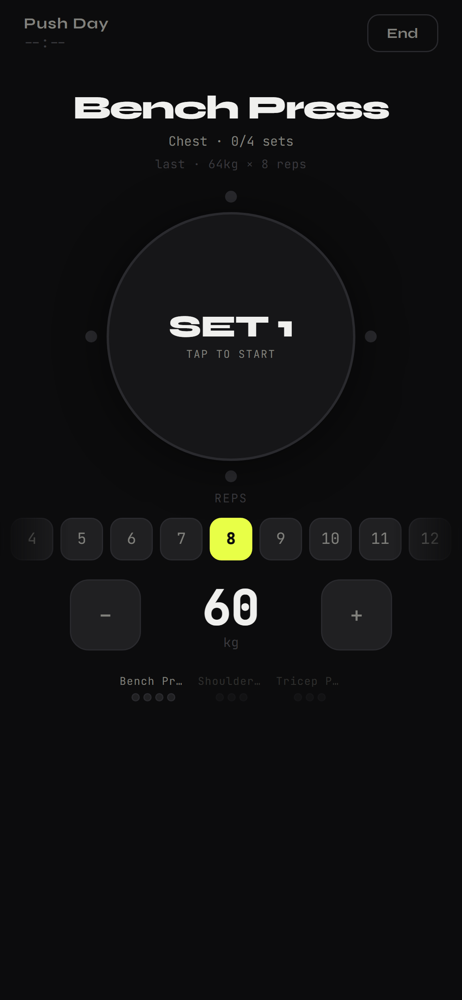
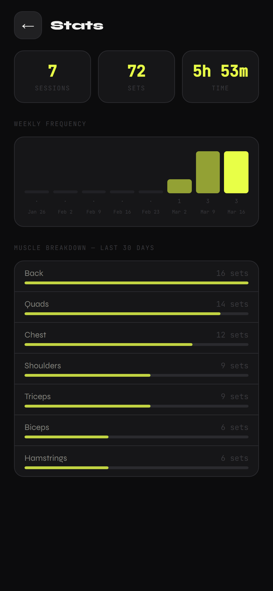
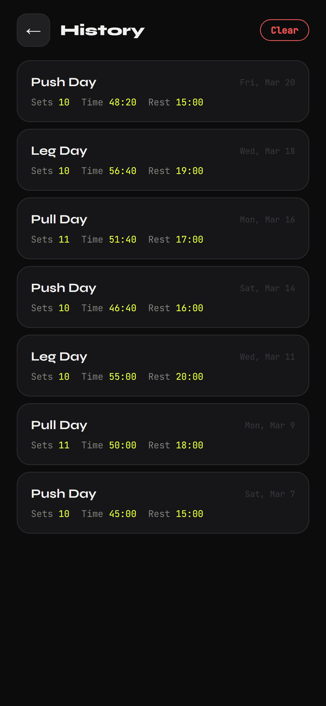

# TapGym

[](https://github.com/RenatoLimaDev/TAPGYM/actions/workflows/ci.yml)
[](https://github.com/RenatoLimaDev/TAPGYM/actions/workflows/deploy.yml)

A mobile-first progressive web app for tracking gym workouts — no account, no backend, no ads. Just tap and lift.

> **Live demo:** https://renatolimadev.github.io/TAPGYM/

---

## Preview

<p align="center">
  
</p>

<p align="center">
  
  
  
  
</p>

---

## Features

### Workout management
- Create and edit workouts with custom exercises, sets, reps, rest time, and target weight
- Assign workouts to days of the week and filter the home screen by day
- Drag-and-drop to reorder exercises within a workout
- Autocomplete exercise names from your own history

### Active session
- Step-by-step set logging with tap-to-complete interaction
- Rest countdown timer with haptic feedback and audio beep alert (Web Audio API) when time is up
- Inline set editing — correct a rep count or weight mid-session
- Bodyweight (BW) indicator when no weight is loaded

### Auto-progression
- Configurable per-exercise weight increment (0 → 20 kg/lbs)
- After a fully completed session (all sets × all reps hit), weight is automatically bumped for next time
- 4-week forecast table in the workout editor showing projected weights

### History & stats
- Full session history with per-exercise set logs
- Weekly training frequency bar chart (last 8 weeks)
- Muscle group breakdown (last 30 days)
- Total sessions, sets, and training time at a glance

### Sharing
- Export any workout (or your full weekly plan) as a compact share code
- Native share sheet on mobile (Web Share API) — send directly via WhatsApp, Telegram, etc.
- Paste a friend's code to import their workout instantly
- Print-to-PDF workout sheet for physical use

### PWA
- Installable on iOS and Android — works like a native app
- Fully offline — all data lives in `localStorage`, zero network dependency
- Safe-area aware layout for notch/Dynamic Island devices

---

## Tech stack

| Layer | Choice | Why |
|---|---|---|
| UI | React 18 | Hooks-only, no class components |
| Build | Vite 5 | Sub-second HMR, native ESM |
| Styling | Inline styles + CSS variables | Zero runtime overhead, no stylesheet conflicts on PWA |
| State | `useState` + `localStorage` | No server needed — data stays on device |
| Audio | Web Audio API | No audio files to load; beep generated at runtime |
| Sharing | `btoa` / `atob` + Web Share API | Serverless workout sharing via base64 |

No routing library, no state manager, no UI framework — just React and the platform.

---

## Architecture

```
src/
├── App.jsx                       # Screen router + auto-progression logic
├── main.jsx                      # Entry point
├── index.css                     # CSS custom properties (theme tokens)
│
├── hooks/
│   ├── useDb.js                  # Load/save from localStorage
│   ├── useToast.js               # Ephemeral notification state
│   └── useConfirm.js             # Two-tap delete confirmation
│
├── utils/
│   └── db.js                     # Constants, dispKg, fmtDuration, initDB
│
├── screens/
│   ├── HomeScreen.jsx            # Day filter + workout cards
│   ├── BuildScreen.jsx           # Create/edit workout + 4-week forecast
│   ├── WorkoutScreen.jsx         # Active session + rest timer + beep
│   ├── HistoryScreen.jsx         # Past session log
│   └── StatsScreen.jsx           # Charts + totals
│
└── components/
    ├── WorkoutCard.jsx            # Summary card with last session info
    ├── ExerciseCard.jsx           # Exercise row with param spinners + drag handle
    ├── WorkoutMetricsOverlay.jsx  # Post-session review + progression badges
    ├── ExportOverlay.jsx          # Share code + PDF print + import
    ├── TourOverlay.jsx            # First-run onboarding tour
    ├── ParamSpin.jsx              # Reusable − value + spinner
    └── Toast.jsx                  # Slide-up notification
```

### Data model

All data is a single JSON object persisted to `localStorage`:

```js
{
  unit: 'kg' | 'lbs',
  day: 0–7,          // 0 = All, 1 = Mon … 7 = Sun
  toured: boolean,
  workouts: [
    {
      id: number,
      name: string,
      day: number,
      exercises: [
        {
          id: number,
          name: string,
          muscle: string,
          sets: number,
          reps: number,
          kg: number,       // 0 = bodyweight
          rest: number,     // seconds
          min: number,      // cardio duration
          progressStep: number,
        }
      ]
    }
  ],
  history: [
    {
      id: number,
      wid: number,          // workout id
      date: string,         // ISO date
      exercises: [
        { name: string, sets: [{ kg, reps, done }] }
      ],
      progressed: [{ name, from, to }],   // auto-progression applied
    }
  ]
}
```

### Auto-progression

After each session, `handleFinish` in `App.jsx` checks every exercise:

```
if (sets_completed >= target_sets AND every_set.reps >= target_reps)
  → next_kg = round(current_kg + progressStep, 0.5)
```

The result is saved both on the workout (for next session) and on the history entry (for the metrics overlay to show the `↑ Exercise → Xkg` badges).

### Workout sharing

Workouts are serialized to a compact array format, JSON-stringified, URI-encoded, and base64-encoded:

```js
// Single
{ v:1, n, d, p, e: [[name, muscle, sets, rest, kg, reps, min, progressStep], …] }

// Weekly plan (All)
{ v:1, ws: [{ n, d, p, e: […] }, …] }
```

The receiver pastes the code into the import field — no server, no QR camera required.

---

## Getting started

```bash
git clone https://github.com/your-username/tapgym-react
cd tapgym-react
npm install
npm run dev
```

Open [http://localhost:5173](http://localhost:5173)

### Build

```bash
npm run build    # outputs to dist/
npm run preview  # preview the production build locally
```

### Deploy

Any static host works — [Netlify](https://netlify.com), [Vercel](https://vercel.com), or [GitHub Pages](https://pages.github.com). No environment variables needed.

---

## Install as PWA

### iOS
1. Open the deployed URL in **Safari**
2. Tap the Share icon → **Add to Home Screen**
3. Opens full-screen with no browser chrome

### Android
1. Open in **Chrome**
2. Tap the menu → **Add to Home Screen** (or the install banner)

---

## License

MIT
